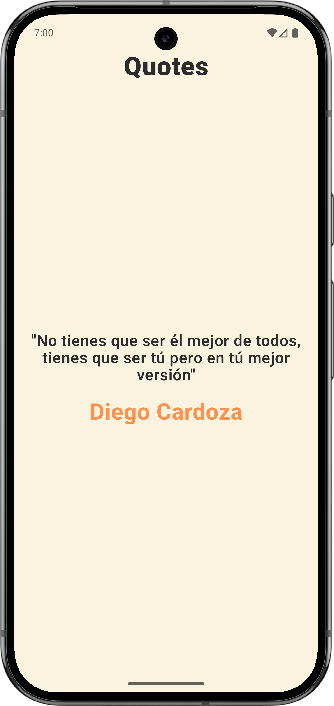
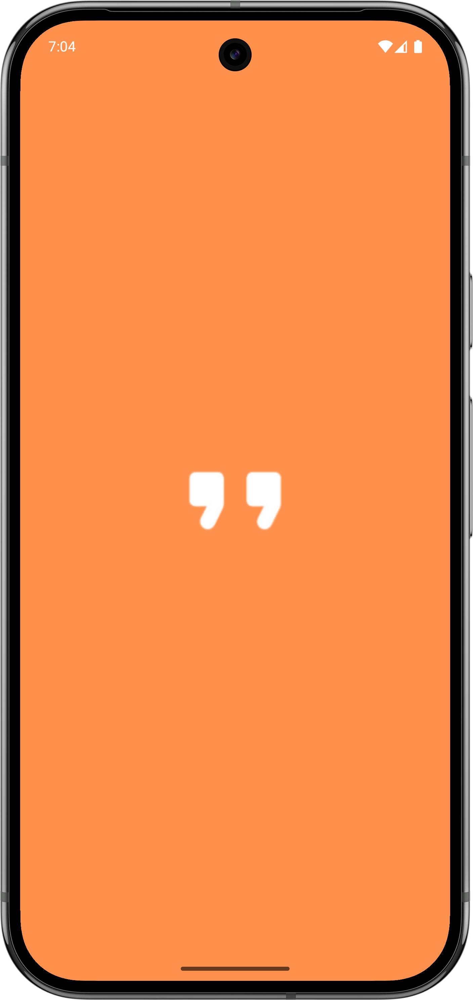

# 📱 Quotes

<div align="center">
  
  
  
</div>

[](https://kotlinlang.org)
[](LICENSE)

Una aplicación Android moderna desarrollada con las mejores prácticas y las últimas tecnologías del ecosistema Android.

## 📋 Tabla de Contenidos

- [Características](#-características)
- [Arquitectura](#-arquitectura)
- [Stack Tecnológico](#-stack-tecnológico)
- [Entornos](#-entornos)
- [Testing](#-testing)

## ✨ Características

- 🎨 UI moderna con Jetpack Compose
- 🚀 Splash Screen con API nativa de Android 12+
- 🏗️ Arquitectura limpia y escalable
- 🔄 Operaciones asíncronas con Coroutines y Flow
- 💾 Persistencia local con Room
- 🌐 Consumo de APIs REST con Retrofit
- 💉 Inyección de dependencias con Hilt
- ✅ Cobertura completa de tests
- 🔧 Múltiples entornos configurables

## 🏗️ Arquitectura

Este proyecto sigue los principios de **Clean Architecture** combinado con el patrón **MVVM** (Model-View-ViewModel), dividiendo la aplicación en tres capas principales:

```
┌─────────────────────────────────────────────┐
│              Presentation Layer             │
│    (UI - Jetpack Compose + ViewModels)      │
└──────────────────┬──────────────────────────┘
                   │
┌──────────────────▼──────────────────────────┐
│              Domain Layer                   │
│     (Use Cases + Entities + Repository      │
│            Interfaces)                      │
└──────────────────┬──────────────────────────┘
                   │
┌──────────────────▼──────────────────────────┐
│              Data Layer                     │
│  (Repository Impl + Data Sources + DTOs)    │
│      (Remote: Retrofit | Local: Room)       │
└─────────────────────────────────────────────┘
```

### Capas

#### 📱 Presentation Layer
- **Composables**: Componentes de UI declarativos con Jetpack Compose
- **ViewModels**: Gestión del estado de la UI y lógica de presentación
- **States**: Representación del estado de la UI

#### 🎯 Domain Layer
- **Use Cases**: Casos de uso que encapsulan la lógica de negocio
- **Entities**: Modelos de dominio puros
- **Repository Interfaces**: Contratos para acceso a datos

#### 💾 Data Layer
- **Repository Implementations**: Implementación de las interfaces del dominio
- **Data Sources**: 
  - Remote: API calls con Retrofit
  - Local: Base de datos con Room
- **DTOs/Mappers**: Transformación entre modelos de datos y entidades

## 🛠️ Stack Tecnológico

### Core
- **Kotlin**: Lenguaje de programación principal
- **Jetpack Compose**: UI declarativa moderna
- **Coroutines**: Programación asíncrona
- **Flow**: Manejo de streams de datos reactivos

### Arquitectura
- **MVVM**: Patrón de presentación
- **Clean Architecture**: Separación de responsabilidades
- **Hilt**: Inyección de dependencias

### Networking & Data
- **Retrofit**: Cliente HTTP para consumo de APIs
- **OkHttp**: Cliente HTTP y logging interceptor
- **Gson**: Serialización JSON
- **Room**: Base de datos local SQLite

### Testing
- **JUnit**: Framework de testing unitario
- **MockK**: Mocking para tests
- **Turbine**: Testing de Flows
- **Compose Testing**: Testing de UI
- **MockWebServer**: Mock de servidor para tests de integración
- **Espresso**: Tests de instrumentación

### Otros
- **Coil**: Carga de imágenes
- **Custom Theming**: Sistema de diseño personalizado

## 🌍 Entornos

La aplicación está configurada con múltiples entornos usando **BuildVariants**:

### Build Variants Disponibles

#### Development (Dev)
- Base URL: `https://quotesapp-dev-default-rtdb.firebaseio.com/`
- Debug habilitado
- Logs detallados
- ApplicationId: `com.example.quotes.dev`

#### Production (Prod)
- Base URL: `https://quotesapp-prod-default-rtdb.firebaseio.com/`
- Ofuscación habilitada
- Sin logs
- ApplicationId: `com.example.quotes`

## 🧪 Testing

El proyecto cuenta con una cobertura completa de tests en tres niveles:

### Tests Unitarios (Unit Tests)

Ubicados en `src/test/`, prueban la lógica de negocio de forma aislada.

### Tests de UI (Compose Tests)

Ubicados en `src/androidTest/`, prueban componentes de Compose.

### Tests de Instrumentación

Ubicados en `src/androidTest/`, prueban la integración con dispositivos reales o emuladores.
